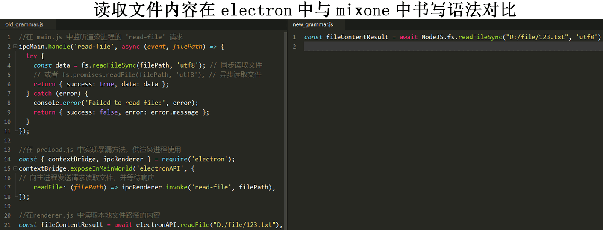
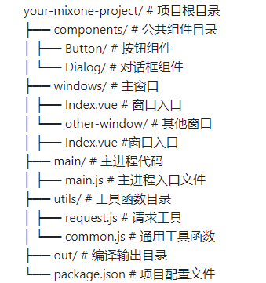

## MixOne简介
**MixOne是一个桌面开发脚手架工具，编写一套代码可以构建BS架构应用和CS架构应用。它以HTML5、JavaScript为主要技术栈，基于electron实现，项目结构精简，随意位置可以编写访问系统级API的代码。**
<p align="center"><a rel="noopener noreferrer"></a></p>

- 支持打包 BS（Browser/Server）浏览器应用。
- 支持打包 CS（Client/Server）桌面应用，包括window、liunx和mac。
- 打包BS架构的web应用支持多html页面，每个html保持支持多组件页面。
- 设计理念：去概念化，给开发者节约精力，专注自己的业务和功能代码。
## 特性——独一无二的设计
- 精简的项目结构，一看就懂，让各种水平的开发者都能接受。
- 弱化主进程和渲染进程的概念，不增加开发者负担。
- 随意位置访问系统API的设计（Election API和NodeJS包），开发随心所欲，得心应手，减轻注意主宣进程的包袱。通过编译机制实现，不存在官方提到的安全问题。
- 双模式打包（桌面应用/Web应用）
- 这是多页面打包，SEO和强大的MVVM应用兼得。
- 主进程代码内容变化自动加载，省去手动重启的麻烦。
- 实时监听项目代码改变并应用。
- 统一窗口管理，方便窗口之间直接通讯，支持打开子模态原生窗口。
- 控制台看主进程的log。解决主进程在命令行无法查看数据结构的问题，独家实现。

## 为什么选择 MixOne
- 基于electron实现，集成了electron的优点以及成熟的生态。electron有很多成熟的方案以及API，甚至是很多很多著名应用都在选择，比如QQ、VS code等。
- 减少对主进程通信需要特别编写代码的麻烦.比如要过多的去考虑事件命名，发送数据结构设计和接收的监听处理函数。MixOne将这一麻烦干掉，由框架机制代理实现这一通信。
- 访问系统功能更方便，比如：以前要想使用强大的HTML5构建界面，但对系统文件读写依赖于部署一个http服务在本机，然后再通过网页ajax去请求这后端（JAVA\PHP\GO\PYTHON）实现本机的文件读写的接口。现在你直接就可以在js中使用方法读取到本机文件。还有其他读取USB操作、读取串口、视频音频处理更方便了。
### MixOne与Qt、Electron的关系和不同。
1. 与Electron的关系：
- MixOne是基于Electron实现的，继承了Electron的优点和生态系统
- 相比原生Electron，MixOne做了以下改进：
  - 弱化了主进程和渲染进程的概念，降低了开发者的心智负担
  - 简化了进程间通信的实现，开发者不需要关注事件命名和数据结构设计
  - 提供了更便捷的系统API访问方式，可以在任意位置使用系统功能
  - 增加了自动热重载、统一窗口管理等开发体验优化
2. 与Qt的区别：
- 技术栈不同：
  - MixOne使用HTML5、JavaScript作为主要技术栈
  - Qt主要使用C++开发
- 开发门槛：
  - MixOne门槛较低，适合各种水平的开发者
  - Qt学习曲线较陡，需要较强的C++基础
- 跨平台实现：
  - MixOne通过Electron实现跨平台，支持window、linux和mac
  - Qt通过自身框架实现跨平台
### MixOne与其他electron框架的对比。
<p align="center"><a rel="noopener noreferrer"></a></p>
MixOne在electron应用开发框架中具有以下独特优势：

| 特性 | MixOne | 其他Electron框架 |
|------|--------|-----------------|
| **架构创新** |
| BS/CS双模式打包 | ✅ 独创，一套代码两种部署 | ❌ 仅支持桌面应用 |
| 项目结构 | ✅ 精简直观，一看就懂 | 较复杂，需要理解框架概念 |
| 主进程概念 | ✅ 去概念化设计，降低心智负担 | 需要明确区分主进程/渲染进程 |
| **开发体验** |
| 系统API访问 | ✅ 随意位置直接访问 | 需要通过IPC或预加载脚本 |
| 进程间通信 | ✅ 框架自动处理，无需关注实现 | 需要手动处理事件和数据结构 |
| 主进程日志 | ✅ 控制台直观查看（独家实现） | 命令行查看，不直观 |
| **功能特性** |
| 多页面支持 | ✅ 原生支持，兼顾SEO | 以单页面应用为主 |
| 窗口管理 | ✅ 统一管理，支持子模态窗口 | 需要手动管理窗口生命周期 |
| 热重载 | ✅ 全局监听，主进程自动加载 | 部分代码需要手动重启 |
| preload.js | ✅ 智能创建和自动合并 | 需要手动配置和维护 |

MixOne的核心优势在于真正实现了"去概念化"设计理念，让开发者可以专注于业务代码开发，不必过多关注底层实现细节。通过创新的BS/CS双模式打包、智能的进程通信处理以及便捷的系统API访问等特性，显著提升了开发效率和使用体验。
## 快速开始
```
npm install mixone -g
//创建项目
mixone create mixone-demo1
cd mixone-demo1
npm install //安装依赖 或 yarn
npm run dev
```
- 基本使用


## 项目结构
- 目录说明

- 文件功能介绍
	- 窗口目录
		* 窗口目录是可以嵌套窗口的，窗口目录以“-window”结尾，否则不是窗口目录。
		* 窗口目录下默认是以Index.vue为访问入口。其他页面组件以XXXPage.vue命名，非Page.vue结尾的组件，只能被引入作为界面上的物件组件。
		* 窗口目录下可以创建preload.js作为窗口的预加载文件，暴露自己定义的方法等功能。preload.js默认会自动创建、若在窗口目录下创建了preload.js则会自动与项目根目录的preload.js合并(如果根preload.js存在)。
		* 窗口目录下的window.json可以配置窗口的属性，在多个位置打开窗口无需再重复编写相同的属性，不存在window.json则默认。
		* 窗口目录下的assets文件夹是静态资源文件夹，当前窗口的组件使用。和全局有区别。
	- main.js
	main/main.js文件是程序的主入口，里面默认就行，能不修改别修改。
	- components
	components是全局的组件目录，会被窗口目录下的组件调用，所有窗口共享。
	assets是全局的静态资源目录，所有窗口共享。
	utils是全局的工具目录，所有窗口共享。不建议main目录下的js引用。

## 核心概念
不产生新的概念就是我们的核心概念。为程序员减负，避免对软件应用进行BS/CS选型。

## 使用指南
- API 调用方式
  - 使用“// @mainProcess”注释声明函数访问了系统API。可以在所有js文件中注释、也可以在vue组件中注释。
  - 使用Main标识符号直接访问Electron的API，方便更快捷（开发中）。
  - 使用PJS标识符访问原生插件。
  - 使用NodeJS访问nodejs的包。
- 窗口管理
  - 创建窗口。
  - 创建窗口的子modal窗口。
  - 窗口之间通讯。
  - 窗口关闭
  - 窗口事件监听
- 构建命令
  - 编译代码 
  - 开启服务
  - 启动electron预览
  - 打包web源码。

- 打包部署（开发中）
## 常见问题
- 当碰到未知问题或其他方式已经无法解决时，怎么办？
“npm run dev”重启应用是比较万能的解决方法，若还是无法解决，请在issues中提交问题，我们会尽快解决。
- 支持react吗？
考虑支持中，暂未实现。
- 支持vue吗？
支持。默认选择vue2.7.16版本，对新浏览器和旧浏览器都支持，并且支持Vue3的组合式API。
- 支持typescript吗？
vue2本身不支持。将来引入的其他库可能支持。敬请期待...
- 如何访问Election的API
主要是指访问Election Main Process API，翻阅electron文档找到使用方法。记得使用了Election API的函数要进行注释。
- 如何访问NodeJS的包
nodejs的内置包可以通过NodeJS.包名直接访问，比如：NodeJS.fs,如果是第三方的包需要提前安装。
- 支持win7吗?
默认内置的electron版本是v23，是支持Win7及以上版本的。
- 支持mac、Ubuntu吗？
尚未测试。
- 改动了需要编辑的代码后没有生效。
请全部重新启动。以Main、NodeJS、PJS开头的语法发生改动后，有时候需要重启才能生效。
- 以Main、NodeJS、PJS开头的语法前的await可以不用写吗？
必须写await，并且所在函数应该是async函数。
- 使用“// @mainProcess”注释的函数内不要使用以Main、NodeJS、PJS开头的语法。
- 以Main、NodeJS、PJS开头的语法所调用的函数内部不能再使用以Main、NodeJS、PJS开头的语法为参数。
是否存在官方所说的安全性问题？mixone是一个编译工具，你在渲染进程访问主进程API的代码以及NodeJS代码都是按照安全机制实现和编译的。
```javascript
//错误的写法
const result = await Main.dialog.showOpenDialog({
    title: '选择一个或多个文件',
    defaultPath: await Main.app.getPath('documents'), // 示例：默认打开文档目录
    buttonLabel: '选择',
    filters: [
        { name: '图片文件', extensions: ['jpg', 'png', 'gif'] },
        { name: '文本文件', extensions: ['txt', 'md'] },
        { name: '所有文件', extensions: ['*'] }
    ],
    properties: ['openFile', 'multiSelections', 'showHiddenFiles'] // 允许选择文件、允许多选、显示隐藏文件
});
//正确的写法
let documentsPath = await Main.app.getPath('documents');
const result = await Main.dialog.showOpenDialog({
    title: '选择一个或多个文件',
    defaultPath: documentsPath, // 示例：默认打开文档目录
    buttonLabel: '选择',
    filters: [
        { name: '图片文件', extensions: ['jpg', 'png', 'gif'] },
        { name: '文本文件', extensions: ['txt', 'md'] },
        { name: '所有文件', extensions: ['*'] }
    ],
    properties: ['openFile', 'multiSelections', 'showHiddenFiles'] // 允许选择文件、允许多选、显示隐藏文件
});
//错误的写法
await NodeJS.path.join(await NodeJS.os.homedir(), 'my_test_document.txt')
//正确的写法
let documentsPath = await NodeJS.os.homedir();
await NodeJS.path.join(documentsPath,'my_test_document.txt')
```
- 不能以别名方式引入组件或文件。
```javascript 
//正确的引入
import {getDocumentsPath2} from '../utils/api/utils.js';
//错误的引入
import {getDocumentsPath2} from '@/utils/api/utils.js';
```
## 未来计划
- 支持vue3
- 支持react
- 支持typescript
- 创建可选更多UI库，比如element-plus，当前内置ant-design-vue。
- 支持electron-builder
- 支持选择更多的electron版本
## 许可证
- 永久免费使用、保留版权前提下可以用于商业用途。
- MixOne is licensed under MIT + Commons Clause