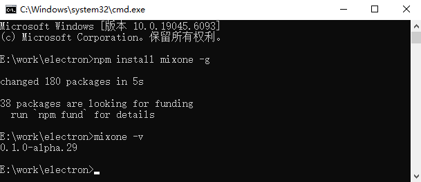
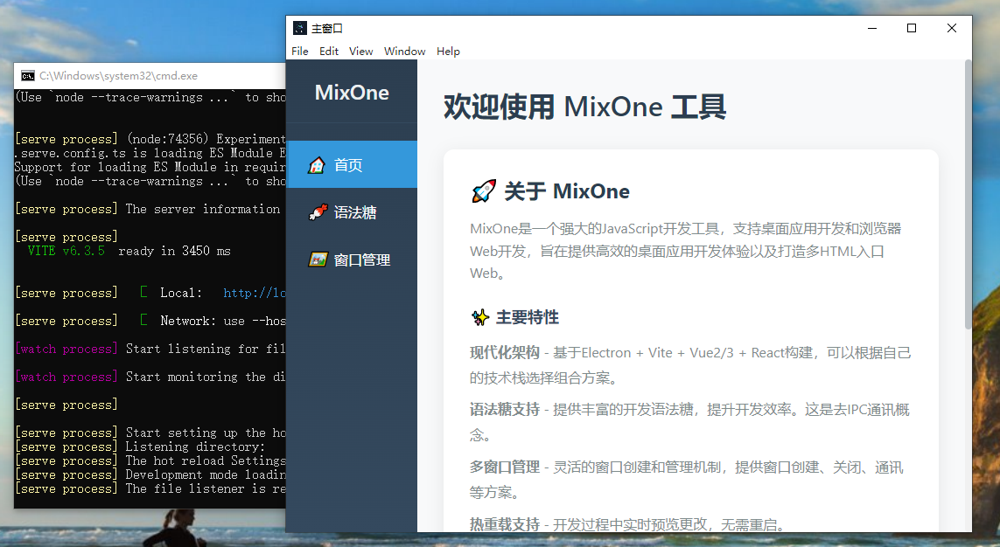
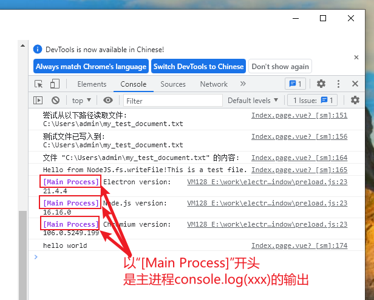
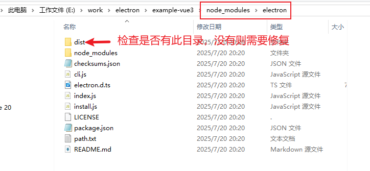
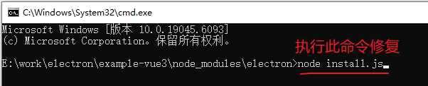

# MixOne文档

# 简介

MixOne是一个Node脚手架工具，基于Vite实现，用于编译HTML5、JavasCript，Vue，React等源代码，支持打包多HTML入口的(*BS架构*)Web应用和打包(*CS架构*)桌面端安装包。它在构建桌面端时是基于Electron实现。

MixOne有自己的语法糖来访问Electron的API和NodeJS的功能，这种语法糖完全可以取代Electron的IPC通讯代码以提高开发效率；另外还可通过注释方式将定义的函数变为主进程函数；还设计了更强大的插件机制来让MixOne在功能扩展上有无限可能。

MixOne目录结构精简，以windows作为根窗口目录，支持多窗口目录嵌套，很好的设计了多窗口的管理机制，提供窗口管理api。

# 安装MixOne

## 一、检查node环境。

请确保你已安装node，并且版本 => v20 

未安装node或node版本低于20的，请到这里下载[https://nodejs.org/en/download](https://nodejs.org/en/download) ，你也可以使用nvm安装。

## 二、运行安装MixOne命令。

```bash
# 全局安装 MixOne CLI
npm install -g mixone

# 检查是否安装成功,出现版本信息即为安装成功！
mixone -v
```



# 快速开始

## 一、创建新项目

```bash
# 创建项目
mixone create my-mixone-app
cd my-mixone-app

# 安装依赖

npm install
# 启动开发服务器
npm run dev
```

按照上述命令操作之后，你将会看到一个启动的桌面应用。



## 二、创建第一个页面。

1. 删除windows下的Index.page.vue(tsx)文件。
2. 创建自己的Index.page.vue，里面应该具有<template><script setup><style scope>三个标签。
3. 在template中输入<div>hello world from mixone</div>

至此，你就创建了第一个界面，如此循环第2、3步骤就会有更多界面。怎么进行路由导航访问请看后面的“**路由跳转及打开新窗口**”章节。

## 三、创建第一个窗口目录。

1. 在/windows/目录下创建setting-window文件夹。
2. 在刚创建的setting-window文件夹内新建一个必须页面组件“Index.page.vue(tsx)”,内部内容为“setting-window中的index页面”。

至此，你就创建了第一个窗口目录，如此循环你会创建更多的窗口目录。如果你要打开该窗口目录，你可以**创建的第一个页面**的实现一个方法即可打开：

```html
<template>
		<div>hello world from mixone</div>
</template>
<script setup>
const openSetting = async () => {
	await window.windowManager.openWindow('/setting-window', {
    width: 1200,
    height: 900
  });
}
</script>
<style scope>
</style>
```

至此，你就打开了一个设置窗口，mixone就擅长这样的多窗口桌面项目的开发。

## 如何学好、用好MixOne工具？

学好MixOne，看了本文档，你应该具备以下两步

1. 第一步**需要掌握快速开发模式**：窗口目录下的可忽略文件不要创建，你只需创建以”XXX.page.vue(tsx)”结尾的页面组件，即可产生以”XXX.page”为路由name和path的路由定义，只需要router.push({path:”XXX.page”})即可使用。
    
    快速开发的注意事项：
    
    - 不要创建任何main.ts(tsx),router.js(ts|tsx)等文件。
    - 在快速开发模式中能数量运用语法糖和注释变主进程函数。
    - 数量规划不同结构的窗口目录让项目结构更清晰。
    - 只有先熟练使用快速开发模式后，再考虑显式创建文件来增强功能。
    - 能够通过打包桌面应用并发布，掌握常用命令。
    - 能够配置window.json来让窗口具备默认属性。
2. 第二步要学会**强大的功能扩展能力**。
    - 能够开发自己的原生插件(Plugin JavaScript)，简称“PJS”。
    - 能够开发自己的预加载功能（preload.js）,让界面打开前已经具备内置的功能。
    - 能够增加main.ts(tsx)来自己安装第三方的插件,vue插件或react插件。
    

关于用好MixOne工具，我认为其是无限可能的，作为开发MixOne的我都在探索它的各种用途。也许你对MixOne的专研，你能用它创造出更独具特色的项目。以下都是用好Mix可突破的方向但不限制：

- 在项目架构方面设计创新合理的项目结构。
- 在跨CS/BS架构上规划好自己的功能。
- 在跨平台桌面上有自己的创新方案。
- 创造可分享给他人复用的PJS。
- ……(你的创意)

# 功能用途

开发桌面应用。

开发多html入口的SPA系统。

开发纯html5原生页面。

开发同时支持浏览器和桌面运行并跨平台的应用。

助力AI项目的开发落地。

容易将原有的web应用桌面化，增强功能。

带界面管理功能的Node服务。

……

# 工具的原理和机制

MixOne的核心原理是将语法糖转译至Electron的主进程，并利用Vite进行实时预览。值得注意的是，在打包桌面应用时，系统采用file://协议访问资源，而非传统的HTTP协议。

**自动路由**机制是MixOne的一项重要功能，适用于Vue和React框架。当窗口目录下不存在router.ts(js|tsx|jsx)文件时，系统会自动激活此功能。它会智能识别当前窗口目录下所有以".page.vue"、".page.tsx"或".page.jsx"结尾的页面组件，并将其自动整合到路由配置中，无需开发者手动添加。在实际使用过程中，页面跳转时只需省略文件后缀（.vue、.tsx、.jsx），系统即可自动识别路由路径。更多详细信息请参阅【路由跳转及打开新窗口】章节。

**手动路由**模式则提供了更高的自定义灵活性。当在窗口目录下创建了router.ts(tsx)文件后，系统内置的自动路由功能将会被覆盖，转而完全遵循该路由文件的配置规则。

MixOne设计了一系列可忽略文件机制，这些文件在默认功能能够满足需求的情况下无需显式创建，仅当需要自定义或扩展特定功能时才需创建。这种设计理念极大简化了开发流程，提高了开发效率。

框架集成方面，MixOne为不同技术栈提供了完善的支持：React项目中已预置集成Redux状态管理系统和React Router Web路由插件；而Vue项目则根据版本不同分别集成了Vuex（Vue 2.7）或Pinia（Vue 3）状态管理工具，以及Vue Router路由系统。

预加载脚本机制是MixOne的另一核心特性。当窗口目录下不存在preload.js文件时，系统会在编译阶段自动生成包含默认内容的预加载脚本。若窗口目录下已有preload.js文件，系统会将其内容附加到默认预加载内容之后，但需注意某些命名空间已被系统占用，开发者不应重复使用以避免冲突。另外，若项目根目录存在preload.js文件，MixOne会智能地将其内容追加到每个窗口目录的预加载脚本中，实现类似"代码复用"的效果。

热更新机制是提升开发体验的关键功能。当开发者修改除main目录外的任何文件时，界面会实时反映这些变化。对于main目录中以fn.js结尾的原生插件文件，修改后同样支持进程级热更新。若修改了main.js主文件本身，系统会自动重启整个应用以确保变更生效。

# 目录结构

React目录结构

```tsx
mixone-react-app/
├── 📂 assets/                    # 🎨 全局静态资源
│   └── 📄 favicon.ico            # 应用图标
├── 📂 components/                # 🧩 全局组件库
│   ├── 📄 Button.tsx             # 按钮组件
│   └── 📄 Dialog.tsx             # 对话框组件
├── 📂 windows/                   # 🖼窗口目录（以 -window 结尾，windows是根窗口目录）
│   ├── 📄 Index.page.tsx         # 主窗口入口页面组件
│   ├── 📂 other-window/          # 其他窗口
│   │   ├── 📄 Index.page.tsx     # 入口页面组件
│   │   ├── 📄 Second.page.tsx    # 页面组件（自动路由）
│   │   ├── 📄 Second.tsx         # 普通组件
│   │   ├── 📄 preload.js         # 窗口预加载脚本(可选)
│   │   └── 📄 window.json        # 窗口配置
│   └── 📂 setting-window/        # 设置窗口
│       ├── 📄 Index.page.tsx     # 入口页面组件
│       ├── 📄 main.tsx            # React 入口（可选）
│       ├── 📄 App.tsx            # 顶层组件（可选）
│       └── 📄 router.tsx          # 路由配置（可选）
├── 📂 main/                      # ⚡ 主进程代码
│   ├── 📄 main.js                # 主进程入口
│   └── 📄 *.fn.js                # 原生插件（PJS 访问）
├── 📂 utils/                     # 🔧 工具函数
│   ├── 📄 request.tsx             # 请求工具
│   └── 📄 common.tsx              # 通用工具
├── 📂 out/                       # 📦 编译输出
└── 📄 package.json               # 项目配置
```

Vue目录结构

```tsx
mixone-vue-app/
├── 📂 assets/                    # 🎨 全局静态资源
│   └── 📄 favicon.ico            # 应用图标
├── 📂 components/                # 🧩 全局组件库
│   ├── 📄 Button.vue             # 按钮组件
│   └── 📄 Dialog.vue             # 对话框组件
├── 📂 windows/                   # 🖼窗口目录（以 -window 结尾，windows是**根窗口目录**）
│   ├── 📄 Index.page.vue         # 主窗口入口页面组件
│   ├── 📂 other-window/          # 其他窗口(**窗口目录**)
│   │   ├── 📄 Index.page.vue     # 入口页面组件
│   │   ├── 📄 Second.page.vue    # 页面组件（自动路由）
│   │   ├── 📄 Second.vue         # 普通组件
│   │   ├── 📄 preload.js         # 窗口预加载脚本(可选)
│   │   └── 📄 window.json        # 窗口配置
│   └── 📂 setting-window/        # 设置窗口(**窗口目录**)
│       ├── 📄 Index.page.vue     # 入口页面组件
│       ├── 📄 main.ts            # Vue 入口（可选）
│       ├── 📄 App.vue            # 顶层组件（可选）
│       └── 📄 router.js          # 路由配置（可选）
├── 📂 main/                      # ⚡ 主进程代码
│   ├── 📄 main.js                # 主进程入口
│   └── 📄 *.fn.js                # 原生插件（PJS 访问）
├── 📂 utils/                     # 🔧 工具函数
│   ├── 📄 request.js             # 请求工具
│   └── 📄 common.js              # 通用工具
├── 📂 out/                       # 📦 编译输出
└── 📄 package.json               # 项目配置
```

# 命令行

使用mixone命令创建的项目会有一个package.json，其中scripts如下：

```tsx
"scripts": {
    "dev": "npm run compile && npm run start:desktop",
    "dev:web": "npm run compile && npm run start:web",
    "compile": "mixone compile",
    "start:desktop": "mixone serve --desktop --watch",
    "start:web": "mixone serve --web --open --watch",
    "build:desktop": "mixone build --desktop",
    "build:web": "mixone build --web",
    "build:win": "npm run compile && npm run build:desktop && mixone package --win",
    "build:mac": "npm run compile && npm run build:desktop && mixone package --mac",
    "build:linux": "npm run compile && npm run build:desktop && mixone package --linux",
    "preview:web": "npm run compile && npm run build:web && mixone preview --start-web",
    "preview:desktop": "npm run compile && npm run build:desktop && mixone preview --start-desktop"
}
```

```tsx
//打开开发模式（同时启动桌面开发和Web开发模式）
npm run dev
//仅打开Web开发模式
npm run dev:web
//编译项目，但是不会启动任何服务 - 不推荐你使用
npm run compile
//打开web服务并启动桌面（前提是已经编译了，否则出问题）
npm run start:desktop
//打开web服务不启动桌面（前提是已经编译了，否则出问题）
npm run start:web
//打包web产物到dist/web目录，作为发布文件。
npm run build:web
//打包window桌面应用的exe,安装包最小体积是61M
npm run build:win
//打包mac桌面应用的dmg
npm run build:mac
//打包linux桌面应用
npm run build:linux
//预览打包后的web,打包web到/dist/web目录后，并启动一个http服务。
npm run preview:web
//预览打包桌面应用。构建所需文件产物，并启动桌面应用。（没有http服务）
npm run preview:desktop
```

注意：*当前MixOne命令还不能在命令行单独使用，否则报错。*

# 窗口管理

MixOne提供了桌面应用的窗口管理类，支持窗口的打开、关闭、给指定窗口发消息、给所有窗口发订阅消息等。

## 窗口类型

- 同级窗口
    1. 在mixone中，通过window.windowManager.openWindow(’/xxx-window/’)打开的窗口都是同级目录，打开同级目录后可以关掉来路的窗口。
    2. 同级窗口可能在项目的windows中的文件夹关系可能是父子关系。决定是否为同级窗口是由打开的方法决定，window.windowManager.openWindow打开的就是同级窗口。
- 子窗口
    
    模态子窗口
    
    通过window.windowManager.openModalWindow(’/xxx-window/’)方法打开的就是模态子窗口。模态子窗口会阻止用户操作父窗口，必须先关掉才能操作父级窗口。
    
    正常子窗口
    
    目前没有单独的方法来实现子窗口。
    

## 窗口目录

窗口目录是通常在Electron桌面应用中作为一个新窗口打开，有一个独立的window.json作为窗口的默认配置（使用openWindow打开窗口时候默认加载该配置）。在构建web后窗口目录的路径也就是一个物理路径的存在，可以指定内部的html进行访问。

**完整的目录结构对比图：**

| 文件 | 说明 | 是否可省略 |
| --- | --- | --- |
| `Index.page.vue(tsx)` | 📄 多个页面组件 | 必须文件 |
| `*.page.vue(tsx)` | 📄 其他页面组件 | 项目需要时不可省略 |
| `preload.js` | 🔌 窗口预加载脚本 | 可省略 |
| `main.js(tsx)` | 🔌 html引入的入口脚本 | 可省略 |
| `App.vue` | 🔌 全局组件 | 可省略 |
| `router.js(tsx)` | 🔌 路由文件 | 可省略 |
| `window.json` | ⚙️ 窗口配置 | 可省略 |
| `index.html` | 📄 Vue|React入口静态页面 | 可省略 |
| `*.html` | 📄 其他静态页面 | 项目需要时不可省略 |

**各种精简的目录结构举例：**

- 只有一个必有的页面组件（SPA应用的最精简）。

| 文件 | 说明 | 是否可省略 |
| --- | --- | --- |
| `Index.page.vue(tsx)` | 📄 默认入口页面组件 | 必须文件 |
- 多个页面组件存在，还有普通组件（能省略的文件都省略）。

| 文件 | 说明 | 是否可省略 |
| --- | --- | --- |
| `Index.page.vue(tsx)` | 📄 默认入口页面组件 | 必须文件 |
| `About.page.vue(tsx)` | 📄 更多页面组件 | 项目需要 |
| `Service.page.vue(tsx)` | 📄 更多页面组件 | 项目需要 |
| `News.page.vue(tsx)` | 📄 更多页面组件 | 项目需要 |
| `news/Detail.page.vue` | 📄 目录里的页面组件 | 项目需要 |
| `GeneralComponent.vue` | 普通组件 | 项目需要 |
- 多个html入口的情况（这是一个窗口目录是HTML5原生多页面的例子）

| 文件 | 说明 | 是否可省略 |
| --- | --- | --- |
| `index.html` | 📄 默认入口静态html文件 | 可省略 |
| `about.html` | 📄 公司介绍 | 项目需要 |
| `service.html` | 📄 公司服务 | 项目需要 |
| `product.html` | 📄 公司产品 | 项目需要 |
| `picture.html` | 📄 公司相册 | 项目需要 |
| `news.html` | 📄 企业新闻 | 项目需要 |
| `news/detail.html` | 📄 新闻阅读 | 项目需要 |

**窗口目录及内部文件的特征：**

1. 命名以“-window”结尾。
2. 有三类文件：
    - 窗口可忽略文件。上面提到的`preload.js`、`main.js(tsx)` 、`App.vue` 、`router.js(tsx)` 、`window.json` 、`index.html` 这6个文件是窗口目录下可以省略的文件。一旦在源窗口目录显式创建这些文件，则这些文件会替代默认内容而生效。详细用法请看后面的“窗口可忽略文件”章节。
    - 窗口项目文件。
        - 整个都是Vue|React的SPA应用。这种情况项目文件都是SPA组件。
        - 窗口里有多个HTML5原生页面。
        - 窗口里既有SPA应用。也有HTML5原生页面。一般来说index.html文件作为SPA的的入口，然后通过SPA组件来实现页面。
    - 窗口必须文件。如果是SPA应用则Index.page.vue(tsx)为必须文件。如果窗口是静态页面项目，则至少需要index.html一个页面作为默认页面。目前不建议一个窗口目录下有多个HTML5入口的SPA应用。
3. 窗口目录中的HTML5文件在Build Web之后依旧生成对应的目录和文件。
4. 桌面中打开一个新窗口对应浏览器打开一个新页面。

你还有其他窗口目录的组合方式？

1. 如果窗口目录是纯HTML5原生应用，那么它的最精简的结构是怎样的？
2. 如果窗口既有SPA应用，又有其他原生HTML5页面。那么有哪些必须文件？
3. 如果窗口目录中的HTML5页面上50个以上，你该如何设计目录结构？

## 窗口可忽略文件

窗口可忽略文件之所以无需创建，是为了让开发者减负，在能不关心的问题上交给MinOne去解决。

当MixOne的默认配置无法满足应用场景时，再把这些忽略文件显式低创建出来，对其进行定制和扩展，以增强功能，使你用MixOne开发出强大的应用，也凸显出MixOne的无限可能。

# 路由跳转及打开新窗口

使用了SPA框架的窗口，使用对应的路由跳转功能来进行组件页面跳转。而html文件则需要使用浏览器原生的路由。

## Vue框架的路由导航

vue-router你可移步到[https://router.vuejs.org/guide/](https://router.vuejs.org/guide/)官网进行阅读，并没有区别。

通过mixone create创建的项目支持vue2.7和vue3，其中vue2.7使用的路由版本是v3.6.5，而vue3使用的是v4.x.x的版本。翻阅文档时请对应版本阅读。

在使用路由导航之前需要先定义路由，而MixOne有自动配置定义路由机制：

1. 窗口目录下的router.ts(js)文件被忽略，那么将会检测窗口目录下以.page.vue结尾的页面组件自动生成router.ts(js)到编译目录。如果窗口目录下有Index.page.vue、About.page.vue两个文件，则会生成vue配置的路由，例子如下：

```jsx
// 引入路由
import { createRouter, createWebHashHistory } from "vue-router";

// 定义路由
const routes:any = [{
          path: '/About.page',
          name: 'About.page',
          component: () => import('./About.page.vue')
        },
      {
          path: '/',
          name: 'Index',
          component: () => import('./Index.page.vue')
        },
      {
          path: '/Index.page',
          name: 'Index.page',
          component: () => import('./Index.page.vue')
        }]
// 创建路由
const router:any = createRouter({
  history: createWebHashHistory(),
  routes, // 路由配置简写形式，同 routes: routes
});
// 导出 router
export default router;
```

使用自动配置 的路由：

```html
<RouterLink to="/">Go to Home</RouterLink>
<RouterLink to="/About.page">Go to About</RouterLink>
```

```jsx
router.push({ path: '/' })
router.push({ path: '/About.page' })
```

2. 手动配置路由。

需要在窗口目录下显式创建router.ts文件，然后按照vue-router官网进行定义路由即可。

**下面是常用的路由导航：**

- RouterLink标签。
    
    ```html
    <RouterLink to="/">Go to Home</RouterLink>
    <RouterLink to="/about">Go to About</RouterLink>
    ```
    
- 编程式

```jsx
// literal string path
router.push('/users/eduardo')
// object with path
router.push({ path: '/users/eduardo' })

router.push({ path: '/home', replace: true })
// equivalent to
router.replace({ path: '/home' })

router.go(1)
router.back(1)
```

## React框架的路由导航

react-router-web可移步至[https://reactrouter.com/7.7.1/home](https://reactrouter.com/7.7.1/home)官网进行阅读，并没有区别。

在使用路由导航之前需要先定义路由，而MixOne有自动配置定义路由机制：

1. 窗口目录下的router.tsx文件被忽略，那么将会检测窗口目录下以.page.tsx结尾的页面组件自动生成router.tsx到编译目录。如果窗口目录下有Index.page.tsx、About.page.tsx两个文件，则会生成react配置的声明式路由，例子如下：

```tsx
// @ts-nocheck
import React from 'react';
import { Route,Routes } from 'react-router-dom';
import AboutPage from './About.page';
import IndexPage from './Index.page';
const AppRoutes: React.FC = () => (
  <Routes>
    <Route path="/About.page" element={<AboutPage />} />
    <Route path="/" element={<IndexPage />} />
    <Route path="/Index.page" element={<IndexPage />} />
  </Routes>
);

export default AppRoutes;
```

使用自动配置的路由

```tsx
<Link to="/About.page">Go to About</Link>
```

2. 手动配置路由。如果你觉得自动路由机制无法满足你，可以显式地创建router.tsx文件，并按照自动路由的生成的规范去自己引入页面组件和定义路由。

以下是常用的**Declarative Mode**路由定义和导航。

```jsx
{/*无刷新标签，a标签会刷新页面导致页面状态消失*/}
<Link to="/about">去关于页</Link>
<Link to="/user/123">去用户123的详情页</Link>
<Link to="/products/new">去新增产品页</Link>
```

## 浏览器原生的路由导航

窗口目录的中的html文件，在桌面可以被打开为一个新窗口，在浏览器中打开为一个新标签。有两种方式实现CS和BS环境的差异化处理。

1. **html的a标签**
    
     **a、**自适应环境的a标签
    
    - 给a标签加上native-target=”_window”可自动适应CS和BS。效果是桌面中打开新窗口，浏览器环境打开新页面。当有target属性时候只影响浏览器。
    - 给a标签加上native-options="{width:1920,height:1080}”可以设置桌面打开窗口的参数。具体配置和window.json的文件配置一样。
    
    **自适应CS和BS的a标签的特性：**
    
    - 支持http协议的URL和file:协议的URL。
    - 支持相对于项目windows目录的路径。
    - 支持使用“..”来访问相对当前html的上一层目录。
    
    ```html
    <a href="../newhtml-window/index.html" native-target="_window">newhtml-window</a>
    ```
    
    **b、**不适应环境的a标签。浏览器原有a标签特性，不过target=”_blank”在CS环境下不会打开新窗口，也不存在新标签一说。
    
    以下是较为全面的举例：
    
    ```html
    <!-- 在桌面中打开新窗口，在浏览器打开页面。上一层目录下的index.html -->
    <a href="../newhtml-window/index.html" native-target="_window">newhtml-window</a>
    <!-- 在桌面中打开新窗口，在浏览器打开页面。打开同级目录下的index.html -->
    <a href="other.html" native-target="_window">other-window</a>
    <!-- 在桌面中打开新窗口，在浏览器打开页面。打开同级目录下的index.html -->
    <a href="./other.html" native-target="_window">other-window</a>
    <!-- 在桌面中打开新窗口，在浏览器打开页面。打开windows目录下的index.html -->
    <a href="/index.html" native-target="_window">/index.html</a>
    <!-- 在桌面中打开新窗口，在浏览器打开页面。打开windows目录下的index.html 会自动默认为index.html-->
    <a href="/" native-target="_window">/index.html</a>
    <!-- 在桌面应用中通常打不开（不是绝对），因为会基于文件的根目录寻找此文件而不存在。在浏览器中可以基于访问域名打开 -->
    <a href="/newhtml-window/index.html">newhtml-window(/newhtml-window/index.html)</a>
    <!-- 在桌面应用中可以在当前窗口打开，在浏览器也是在当前窗口打开 -->
    <a href="../newhtml-window/index.html">new html</a>
    <!-- 在桌面应用中可以在当前窗口打开，在浏览器也是在当前窗口打开 -->
    <a href="http://localhost:5173/newhtml-window/index.html">http://localhost:5173/newhtml-window/index.html</a>
    <!-- 在左面中可以在当前窗口打开，在浏览器也是在当前窗口打开 -->
    <a href="http://localhost:5173/index.html">http://localhost:5173/index.html</a>
    <!-- 在桌面应用中可以在当前窗口打开，在浏览器也是在当前窗口打开 -->
    <a href="http://localhost:5173/">http://localhost:5173/</a>
    <!-- 在桌面中打开新窗口，在浏览器打开页面。支持打开http链接，并且支持配置窗口选项-->
    <a href="https://www.baidu.com/" native-target="_window" native-options="{width:1920,height:1080}">https://www.baidu.com/</a>
    <!-- 在桌面中打开新窗口，在浏览器打开页面。支持打开本地存在的文件，并且支持配置窗口选项-->
    <a href="file:///E:/work/electron/demo-vue3-5/dist/packager/win-unpacked/resources/app.asar/out/build/windows/index.html" native-target="_window" native-options="{width:1920,height:1080}">file:///E:/work/electron/demo-vue3-5/dist/packager/win-unpacked/resources/app.asar/out/build/windows/index.html</a>
    ```
    
    **此a标签的举例你应该仔细学习。**
    
2. **Javascript的方法**，CS环境打开新窗口，BS环境走location.href、location.replace、window.open。
    - location.href。通过修改 location.href 或调用 location.assign() 加载新页面，生成历史记录，用户可后退。**通过环境检测变量”window.isMixone”检测为桌面时，使用窗口管理（window.windowManager）类来openWindow（openModalWindow）打开新窗口。**
    
    ```jsx
    window.location.href = "https://example.com/new-page";
    // 或
    window.location.assign("https://example.com/new-page");
    ```
    
    - location.replace。 用新 URL 替换当前页面，不生成历史记录，用户无法通过浏览器后退按钮返回原页面。**通过环境检测变量”window.isMixone”检测为桌面时，使用窗口管理（window.windowManager）类来openWindow（openModalWindow）打开新窗口。**
    
    ```jsx
    window.location.replace("https://example.com/new-page");
    ```
    
    - window.open()。 在新窗口或标签页中打开 URL，可自定义窗口属性（如大小、工具栏等）。**通过环境检测变量”window.isMixone”检测为桌面时，使用窗口管理（window.windowManager）类来openWindow（openModalWindow）打开新窗口。**

**SPA框架路由（vue-router、react-router-dom）和浏览器原生路由的区别：**SPA框架路由不支持打开新窗口、包括子模态窗口。

# 去IPC语法

去IPC语法也可以说是绕靠IPC繁琐的开发模式。

**去IPC的两种方式：**

## 语法糖。

以Main、NodeJS、PJS开始访问 electron的API和node包和插件（Plugin JS）。

```tsx
//通过Main开始的语法糖获取系统的documents路径
let path = await Main.app.getPath('documents');
```

注意事项：

- 必须在语法糖前加await才生效。
- 语法糖不能嵌套，需要先后顺序。
- 不支持promise的then的书写模式。

## 注释。

以”// @mainProcess”注释将函数变为主进程代码。需要注意以下几点：

- 支持function定义的函数，支持变量定义的普通函数（和箭头函数）
- 函数必须是顶层作用域的函数，而不是其他作用域内被嵌套的内部函数。
- 函数内的变量引用必须是函数体内定义的变量，不能引用函数体外定义的变量（参数属于函数体内的变量）。
- 不要在函数体内使用语法糖，这种混用是不支持的。

# 构建生产版本

## 构建命令:

```bash
//打包window的桌面端
npm run build:win
//打包mac的桌面端
npm run build:mac
//打包liunx的桌面端
npm run build:linux

//打包web发布。
npm run build:web
```

## 生产版本输出文件夹

- 桌面端文件打包到/dist/packager目录，web打包到/dist/web目录。
- 优化打包体积
    - 使用mini打包
    - 将vue或react移动到devDependencies（node使用的包才放在dependencies）
    - 压缩图片
    - 尽量复用组件。
    - 尽量避免安装第三方包

# 环境变量和模式

- **已打包环境。**已打包桌面应用或web产物后运行的环境。已打包的桌面应用是file:协议加载html文件作为桌面视图。
- **未打包环境。**
    - 开发模式。以“npm run dev”和“npm run dev:web”就是开发环境，主要是会创建http服务让开发时候可以因修改而热加载，便于预览。
    - 预览模式。以“npm run preview:web”会构建生产的产物并打开http服务以预览，无误即可发布上生产环境。“npm run preview:desktop”会构建html产物，然后桌面以file:协议加载预览是否有误，无误即可正式使用**构建命令**打包桌面应用。

# 调试

## 启动和编译日志

位于项目的/mixone-project/out/logs/xxxx.txt

## 打包后运行错误日志

位于系统的AppData目录，window下通常是C:\Users\admin\AppData\Local\mixone-project\logs\main_process.log

其他系统请自寻找到app.getPath('userData') + ‘logs/main_process.log’位置即可查看错误日志。若不出错是不会有错误日志的（*不是运行日志*）

## 控制台查看主进程log输出

当我们使用mixone开发桌面时，可从窗口的控制台查看主进程的日志，而无需切换到控制台。

控制台的日志以“[Main Process]”开头，其他则为渲染进程的日志。并非所有主进程console.log都会在开发控制台输出，比如值是函数类型的情况在控制台无法显示。



# 故障排除

- 安装mixone不成功
    - 更换镜像源
    
    ```bash
    //检查镜像源
    npm config get registry
    //如果不是淘宝镜像https://registry.npmmirror.com 你可以修改为淘宝镜像
    npm config set registry=https://registry.npmmirror.com
    ```
    
    - 使用yarn安装
    
    ```bash
    cd mixone-project-dir/
    yarn
    ```
    
- npm run dev 没有打开桌面？
    - 确实使用此命令前，已经进入改目录执行了“npm install”命令。可以用yarn安装。
    - 在命令行 cd 项目目录/node_modules/electron  目录，检查是否有 dist/electron.exe文件，若没有，则需要执行node install.js以安装。
        
        
        
        
        

# API

MinOne提供的API可以在它创建的MixOne项目中的任何JavaScript脚本位置使用，包括使用在js、ts、tsx、vue等文件中。有的API在主进程和渲染进程中又有区别。

## 窗口管理类

window.windowManager是窗口管理类，具体可访问的方法如下：

| 方法名 | main目录使用 | 非main目录 | 参数 | 说明 |
| --- | --- | --- | --- | --- |
| openWindow | ✅ | ✅ | (windowPath, options = {}) | 打开新窗口 |
| openModalWindow | ✅ | ✅ | (parentWinId, windowPath, options = {}) | 打开模态窗口 |
| getAllWindow | ✅ | ✅ | () | 获取所有窗口信息 |
| getWindowInfo | ✅ | ✅ | (winId) | 获取指定窗口信息 |
| getWindow | ✅ | ✅ | (winId) | 获取指定窗口对象 |
| sendToWindow | ✅ | ✅ | (winId, eventName, data) | 向指定窗口发送消息 |
| broadcast | ✅ | ✅ | (channel, data, excludeWinIds = []) | 广播消息到所有窗口 |

## 窗口目录内置常量和方法：

- window.winId 常量
- window.fromWinId 常量。获取窗口打开来路窗口的ID，如果为0表示首次启动，没有来路窗口。
- window.openWindow()打开新窗口，是window.windowManager.openWindow()的简写

## Main语法糖访问Electron API举例

未完待续…