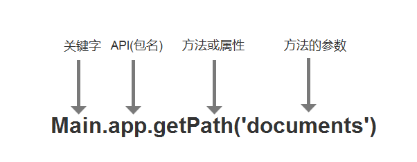
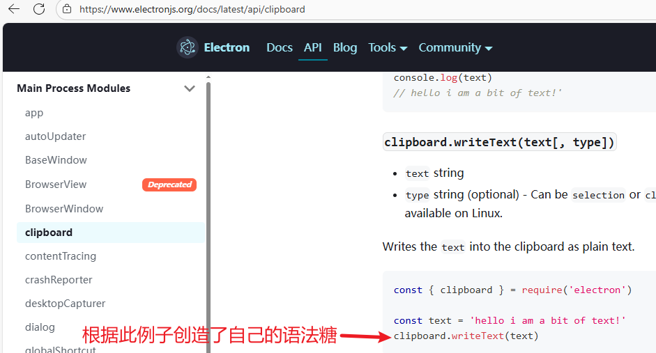
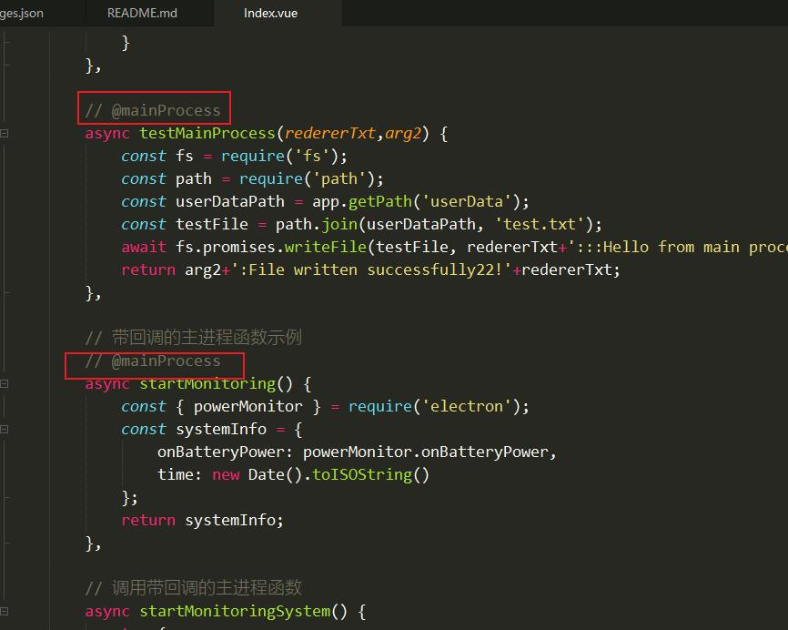
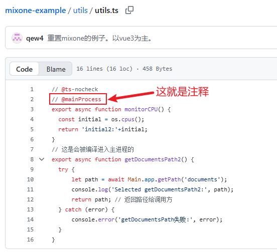
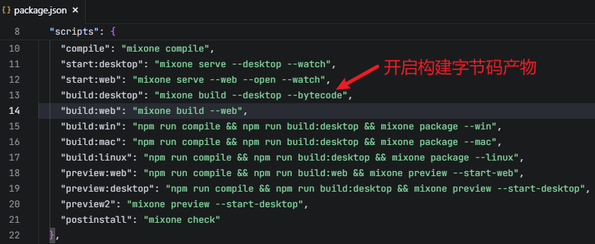

# MixOne文档 v0.1.0-beta.4

# 简介

MixOne是一个Node脚手架工具，基于Vite实现，用于编译HTML5、JavaScript，Vue，React等源代码，支持打包多HTML入口的(*BS架构*)Web应用和打包(*CS架构*)桌面端安装包。它在构建桌面端时是基于Electron实现。

MixOne有自己的语法糖来访问Electron的API和NodeJS的功能，这种语法糖完全可以取代Electron的IPC通讯代码以提高开发效率；另外还可通过注释方式将定义的函数变为主进程函数；还设计了更强大的插件机制来让MixOne在功能扩展上有无限可能。

MixOne目录结构精简，以windows作为根窗口目录，支持多窗口目录嵌套，很好的设计了多窗口的管理机制，提供窗口管理api。

# 安装MixOne

## 一、检查node环境。

请确保你已安装node，并且版本 => v20 

未安装node或node版本低于20的，请到这里下载[https://nodejs.org/en/download](https://nodejs.org/en/download) ，你也可以使用nvm安装。

## 二、运行安装MixOne命令。

```bash
# 全局安装 MixOne CLI
npm install -g mixone

# 检查是否安装成功,出现版本信息即为安装成功！
mixone -v
```


# 快速开始

## 一、创建新项目

```bash
# 创建项目
mixone create my-mixone-app
cd my-mixone-app

# 安装依赖

npm install
# 启动开发服务器
npm run dev
```

按照上述命令操作之后，你将会看到一个启动的桌面应用。


## 二、创建第一个页面。

1. 删除windows下的Index.page.vue(tsx)文件。
2. 创建自己的Index.page.vue，里面应该具有<template><script setup><style scope>三个标签。
3. 在template中输入<div class=”hellocolor”>hello world from mixone</div>

至此，你就创建了第一个界面，如此循环第2、3步骤就会有更多界面。怎么进行路由导航访问请看后面的“**路由跳转及打开新窗口**”章节。

如果你的你要给className为”hellocolor“的元素添加颜色，你可以使用内联样式，在独立文件中创建样式。比如你在/assets/css/auto_style.css，那么这个以”auto_”开头的css文件会自动引入内部的样式将会可用。

```jsx
/assets/css/auto_style.css
.hellocolor {
	color:red;
}
```

## 三、创建第一个窗口目录。

1. 在/windows/目录下创建setting-window文件夹。
2. 在刚创建的setting-window文件夹内新建一个必须页面组件“Index.page.vue(tsx)”,内部内容为“setting-window中的index页面”。

至此，你就创建了第一个窗口目录，如此循环你会创建更多的窗口目录。如果你要打开该窗口目录，你可以**创建的第一个页面**的实现一个方法即可打开：

```html
<template>
		<div>hello world from mixone</div>
</template>
<script setup>
const openSetting = async () => {
	await window.windowManager.openWindow('/setting-window', {
    width: 1200,
    height: 900
  });
}
</script>
<style scope>
</style>
```

至此，你就打开了一个设置窗口，mixone就擅长这样的多窗口桌面项目的开发。

## 如何学好、用好MixOne工具？

学好MixOne，看了本文档，你应该具备以下两点

1. 第一步**需要掌握快速开发模式**：窗口目录下的可忽略文件不要创建，你只需创建以”XXX.page.vue(tsx)”结尾的页面组件，即可产生以”XXX.page”为路由name和path的路由定义，只需要router.push({path:”XXX.page”})即可使用。
    
    快速开发的注意事项：
    
    - 不要创建任何main.ts(tsx),router.js(ts|tsx)等文件。
    - 在快速开发模式中能数量运用语法糖和注释变主进程函数。
    - 数量规划不同结构的窗口目录让项目结构更清晰。
    - 只有先熟练使用快速开发模式后，再考虑显式创建文件来增强功能。
    - 能够通过打包桌面应用并发布，掌握常用命令。
    - 能够配置window.json来让窗口具备默认属性。
2. 第二步要学会**强大的功能扩展能力**。
    - 能够开发自己的原生插件(Plugin JavaScript)，简称“PJS”。
    - 能够开发自己的预加载功能（preload.js）,让界面打开前已经具备内置的功能。
    - 能够增加main.ts(tsx)来自己安装第三方的插件,vue插件或react插件。
    

关于用好MixOne工具，我认为其是无限可能的，作为开发MixOne的我都在探索它的各种用途。也许你对MixOne的专研，你能用它创造出更独具特色的项目。以下都是用好Mix可突破的方向但不限制：

- 在项目架构方面设计创新合理的项目结构。
- 在跨CS/BS架构上规划好自己的功能。
- 在跨平台桌面上有自己的创新方案。
- 创造可分享给他人复用的PJS。
- ……(你的创意)

# 功能用途

开发桌面应用。

开发多html入口的SPA系统。

开发纯html5原生页面。

开发同时支持浏览器和桌面运行并跨平台的应用。

助力AI项目的开发落地。

容易将原有的web应用桌面化，增强功能。

带界面管理功能的Node服务。

……

# 工具的原理和机制

MixOne的核心原理是将语法糖转译至Electron的主进程，并利用Vite进行实时预览。值得注意的是，在打包桌面应用时，系统采用file://协议访问资源，而非传统的HTTP协议。

**自动路由**机制是MixOne的一项重要功能，适用于Vue和React框架。当窗口目录下不存在router.ts(js|tsx|jsx)文件时，系统会自动激活此功能。它会智能识别当前窗口目录下所有以".page.vue"、".page.tsx"或".page.jsx"结尾的页面组件，并将其自动整合到路由配置中，无需开发者手动添加。在实际使用过程中，页面跳转时只需省略文件后缀（.vue、.tsx、.jsx），系统即可自动识别路由路径。更多详细信息请参阅【路由跳转及打开新窗口】章节。

**手动路由**模式则提供了更高的自定义灵活性。当在窗口目录下创建了router.ts(tsx)文件后，系统内置的自动路由功能将会被覆盖，转而完全遵循该路由文件的配置规则。

MixOne设计了一系列可忽略文件机制，这些文件在默认功能能够满足需求的情况下无需显式创建，仅当需要自定义或扩展特定功能时才需创建。这种设计理念极大简化了开发流程，提高了开发效率。

框架集成方面，MixOne为不同技术栈提供了完善的支持：React项目中已预置集成Redux状态管理系统和React Router Web路由插件；而Vue项目则根据版本不同分别集成了Vuex（Vue 2.7）或Pinia（Vue 3）状态管理工具，以及Vue Router路由系统。

**预加载脚本机制**是MixOne的另一核心特性。当窗口目录下不存在preload.js文件时，系统会在编译阶段自动生成包含默认内容的预加载脚本。若窗口目录下已有preload.js文件，系统会将其内容附加到默认预加载内容之后，但需注意某些命名空间已被系统占用，开发者不应重复使用以避免冲突。另外，若项目根目录存在preload.js文件，MixOne会智能地将其内容追加到每个窗口目录的预加载脚本中，实现类似"代码复用"的效果。

**热更新机制**是提升开发体验的关键功能。当开发者修改除main目录外的任何文件时，界面会实时反映这些变化。对于main目录中以fn.js结尾的原生插件文件，修改后同样支持进程级热更新。若修改了main.js主文件本身，系统会自动重启整个应用以确保变更生效。

**自动加载文件机制：**当你在/assets目录中以”auto_“开头命名的css和js,tsx,ts文件将会自动引入到SPA框架内，原生HTML5页面没有此机制。

# 目录结构

React目录结构

```tsx
mixone-react-app/
├── 📂 assets/                    # 🎨 全局静态资源
│   └── 📄 favicon.ico            # 应用图标
├── 📂 components/                # 🧩 全局组件库
│   ├── 📄 Button.tsx             # 按钮组件
│   └── 📄 Dialog.tsx             # 对话框组件
├── 📂 windows/                   # 🖼窗口目录（以 -window 结尾，windows是根窗口目录）
│   ├── 📄 Index.page.tsx         # 主窗口入口页面组件
│   ├── 📂 other-window/          # 其他窗口
│   │   ├── 📄 Index.page.tsx     # 入口页面组件
│   │   ├── 📄 Second.page.tsx    # 页面组件（自动路由）
│   │   ├── 📄 Second.tsx         # 普通组件
│   │   ├── 📄 preload.js         # 窗口预加载脚本(可选)
│   │   └── 📄 window.json        # 窗口配置
│   └── 📂 setting-window/        # 设置窗口
│       ├── 📄 Index.page.tsx     # 入口页面组件
│       ├── 📄 main.tsx            # React 入口（可选）
│       ├── 📄 App.tsx            # 顶层组件（可选）
│       └── 📄 router.tsx          # 路由配置（可选）
├── 📂 main/                      # ⚡ 主进程代码
│   ├── 📄 main.js                # 主进程入口
│   └── 📄 *.fn.js                # 原生插件（PJS 访问）
├── 📂 utils/                     # 🔧 工具函数
│   ├── 📄 request.tsx             # 请求工具
│   └── 📄 common.tsx              # 通用工具
├── 📂 out/                       # 📦 编译输出
└── 📄 package.json               # 项目配置
```

Vue目录结构

```tsx
mixone-vue-app/
├── 📂 assets/                    # 🎨 全局静态资源
│   └── 📄 favicon.ico            # 应用图标
├── 📂 components/                # 🧩 全局组件库
│   ├── 📄 Button.vue             # 按钮组件
│   └── 📄 Dialog.vue             # 对话框组件
├── 📂 windows/                   # 🖼窗口目录（以 -window 结尾，windows是**根窗口目录**）
│   ├── 📄 Index.page.vue         # 主窗口入口页面组件
│   ├── 📂 other-window/          # 其他窗口(**窗口目录**)
│   │   ├── 📄 Index.page.vue     # 入口页面组件
│   │   ├── 📄 Second.page.vue    # 页面组件（自动路由）
│   │   ├── 📄 Second.vue         # 普通组件
│   │   ├── 📄 preload.js         # 窗口预加载脚本(可选)
│   │   └── 📄 window.json        # 窗口配置
│   └── 📂 setting-window/        # 设置窗口(**窗口目录**)
│       ├── 📄 Index.page.vue     # 入口页面组件
│       ├── 📄 main.ts            # Vue 入口（可选）
│       ├── 📄 App.vue            # 顶层组件（可选）
│       └── 📄 router.js          # 路由配置（可选）
├── 📂 main/                      # ⚡ 主进程代码
│   ├── 📄 main.js                # 主进程入口
│   └── 📄 *.fn.js                # 原生插件（PJS 访问）
├── 📂 utils/                     # 🔧 工具函数
│   ├── 📄 request.js             # 请求工具
│   └── 📄 common.js              # 通用工具
├── 📂 out/                       # 📦 编译输出
└── 📄 package.json               # 项目配置
```

# 命令行

使用mixone命令创建的项目会有一个package.json，其中scripts如下：

```tsx
"scripts": {
    "dev": "npm run compile && npm run start:desktop",
    "dev:web": "npm run compile && npm run start:web",
    "compile": "mixone compile",
    "start:desktop": "mixone serve --desktop --watch",
    "start:web": "mixone serve --web --open --watch",
    "build:desktop": "mixone build --desktop",
    "build:web": "mixone build --web",
    "build:win": "npm run compile && npm run build:desktop && mixone package --win",
    "build:mac": "npm run compile && npm run build:desktop && mixone package --mac",
    "build:linux": "npm run compile && npm run build:desktop && mixone package --linux",
    "preview:web": "npm run compile && npm run build:web && mixone preview --start-web",
    "preview:desktop": "npm run compile && npm run build:desktop && mixone preview --start-desktop"
}
```

```tsx
//打开开发模式（同时启动桌面开发和Web开发模式）
npm run dev
//仅打开Web开发模式
npm run dev:web
//编译项目，但是不会启动任何服务 - 不推荐你使用
npm run compile
//打开web服务并启动桌面（前提是已经编译了，否则出问题）
npm run start:desktop
//打开web服务不启动桌面（前提是已经编译了，否则出问题）
npm run start:web
//打包web产物到dist/web目录，作为发布文件。
npm run build:web
//打包window桌面应用的exe,安装包最小体积是61M
npm run build:win
//打包mac桌面应用的dmg
npm run build:mac
//打包linux桌面应用
npm run build:linux
//预览打包后的web,打包web到/dist/web目录后，并启动一个http服务。
npm run preview:web
//预览打包桌面应用。构建所需文件产物，并启动桌面应用。（没有http服务）
npm run preview:desktop
```

注意：*当前MixOne命令还不能在命令行单独使用，否则报错。*

# 窗口管理

MixOne提供了桌面应用的窗口管理类，支持窗口的打开、关闭、给指定窗口发消息、给所有窗口发订阅消息等。

## 窗口类型

- 同级窗口
    1. 在mixone中，通过window.windowManager.openWindow(’/xxx-window/’)打开的窗口都是同级目录，打开同级目录后可以关掉来路的窗口。
    2. 同级窗口可能在项目的windows中的文件夹关系可能是父子关系。决定是否为同级窗口是由打开的方法决定，window.windowManager.openWindow打开的就是同级窗口。
- 子窗口
    
    模态子窗口
    
    通过window.windowManager.openModalWindow(’/xxx-window/’)方法打开的就是模态子窗口。模态子窗口会阻止用户操作父窗口，必须先关掉才能操作父级窗口。
    
    正常子窗口
    
    目前没有单独的方法来实现子窗口。
    

## 窗口目录

窗口目录是通常在Electron桌面应用中作为一个新窗口打开，有一个独立的window.json作为窗口的默认配置（使用openWindow打开窗口时候默认加载该配置）。在构建web后窗口目录的路径也就是一个物理路径的存在，可以指定内部的html进行访问。

**完整的目录结构对比图：**

| 文件 | 说明 | 是否可省略 |
| --- | --- | --- |
| `Index.page.vue(tsx)` | 📄 多个页面组件 | 必须文件 |
| `*.page.vue(tsx)` | 📄 其他页面组件 | 项目需要时不可省略 |
| `preload.js` | 🔌 窗口预加载脚本 | 可省略 |
| `main.js(tsx)` | 🔌 html引入的入口脚本 | 可省略 |
| `App.vue` | 🔌 全局组件 | 可省略 |
| `router.js(tsx)` | 🔌 路由文件 | 可省略 |
| `window.json` | ⚙️ 窗口配置 | 可省略 |
| `index.html` | 📄 Vue|React入口静态页面 | 可省略 |
| `*.html` | 📄 其他静态页面 | 项目需要时不可省略 |

**各种精简的目录结构举例：**

- 只有一个必有的页面组件（SPA应用的最精简）。

| 文件 | 说明 | 是否可省略 |
| --- | --- | --- |
| `Index.page.vue(tsx)` | 📄 默认入口页面组件 | 必须文件 |
- 多个页面组件存在，还有普通组件（能省略的文件都省略）。

| 文件 | 说明 | 是否可省略 |
| --- | --- | --- |
| `Index.page.vue(tsx)` | 📄 默认入口页面组件 | 必须文件 |
| `About.page.vue(tsx)` | 📄 更多页面组件 | 项目需要 |
| `Service.page.vue(tsx)` | 📄 更多页面组件 | 项目需要 |
| `News.page.vue(tsx)` | 📄 更多页面组件 | 项目需要 |
| `news/Detail.page.vue` | 📄 目录里的页面组件 | 项目需要 |
| `GeneralComponent.vue` | 普通组件 | 项目需要 |
- 多个html入口的情况（这是一个窗口目录是HTML5原生多页面的例子）

| 文件 | 说明 | 是否可省略 |
| --- | --- | --- |
| `index.html` | 📄 默认入口静态html文件 | 可省略 |
| `about.html` | 📄 公司介绍 | 项目需要 |
| `service.html` | 📄 公司服务 | 项目需要 |
| `product.html` | 📄 公司产品 | 项目需要 |
| `picture.html` | 📄 公司相册 | 项目需要 |
| `news.html` | 📄 企业新闻 | 项目需要 |
| `news/detail.html` | 📄 新闻阅读 | 项目需要 |

**窗口目录及内部文件的特征：**

1. 命名以“-window”结尾。
2. 有三类文件：
    - 窗口可忽略文件。上面提到的`preload.js`、`main.js(tsx)` 、`App.vue` 、`router.js(tsx)` 、`window.json` 、`index.html` 这6个文件是窗口目录下可以省略的文件。一旦在源窗口目录显式创建这些文件，则这些文件会替代默认内容而生效。详细用法请看后面的“窗口可忽略文件”章节。
    - 窗口项目文件。
        - 整个都是Vue|React的SPA应用。这种情况项目文件都是SPA组件。
        - 窗口里有多个HTML5原生页面。
        - 窗口里既有SPA应用。也有HTML5原生页面。一般来说index.html文件作为SPA的的入口，然后通过SPA组件来实现页面。
    - 窗口必须文件。如果是SPA应用则Index.page.vue(tsx)为必须文件。如果窗口是静态页面项目，则至少需要index.html一个页面作为默认页面。目前不建议一个窗口目录下有多个HTML5入口的SPA应用。
3. 窗口目录中的HTML5文件在Build Web之后依旧生成对应的目录和文件。
4. 桌面中打开一个新窗口对应浏览器打开一个新页面。

你还有其他窗口目录的组合方式？

1. 如果窗口目录是纯HTML5原生应用，那么它的最精简的结构是怎样的？
2. 如果窗口既有SPA应用，又有其他原生HTML5页面。那么有哪些必须文件？
3. 如果窗口目录中的HTML5页面上50个，你该如何设计目录结构？

## 窗口可忽略文件

窗口可忽略文件之所以无需创建，是为了让开发者减负，在不必关心的问题上交给MinOne去解决。

当MixOne的默认配置无法满足应用场景时，再把这些忽略文件显式地创建出来，对其进行定制和扩展，以增强功能，使你用MixOne开发出强大的应用，也凸显出MixOne的无限可能。

# 路由跳转及打开新窗口

使用了SPA框架的窗口，使用对应的路由跳转功能来进行组件页面跳转。而html文件则需要使用浏览器原生的路由。

## Vue框架的路由导航

vue-router你可移步到[https://router.vuejs.org/guide/](https://router.vuejs.org/guide/)官网进行阅读，并没有区别。

通过mixone create创建的项目支持vue2.7和vue3，其中vue2.7使用的路由版本是v3.6.5，而vue3使用的是v4.x.x的版本。翻阅文档时请对应版本阅读。

在使用路由导航之前需要先定义路由，而MixOne有自动配置定义路由机制：

1. 窗口目录下的router.ts(js)文件被忽略，那么将会检测窗口目录下以.page.vue结尾的页面组件自动生成router.ts(js)到编译目录。如果窗口目录下有Index.page.vue、About.page.vue两个文件，则会生成vue配置的路由，例子如下：

```jsx
// 引入路由
import { createRouter, createWebHashHistory } from "vue-router";

// 定义路由
const routes:any = [{
          path: '/About.page',
          name: 'About.page',
          component: () => import('./About.page.vue')
        },
      {
          path: '/',
          name: 'Index',
          component: () => import('./Index.page.vue')
        },
      {
          path: '/Index.page',
          name: 'Index.page',
          component: () => import('./Index.page.vue')
        }]
// 创建路由
const router:any = createRouter({
  history: createWebHashHistory(),
  routes, // 路由配置简写形式，同 routes: routes
});
// 导出 router
export default router;
```

使用自动配置 的路由：

```html
<RouterLink to="/">Go to Home</RouterLink>
<RouterLink to="/About.page">Go to About</RouterLink>
```

```jsx
router.push({ path: '/' })
router.push({ path: '/About.page' })
```

2. 手动配置路由。

需要在窗口目录下显式创建router.ts文件，然后按照vue-router官网进行定义路由即可。

**下面是常用的路由导航：**

- RouterLink标签。
    
    ```html
    <RouterLink to="/">Go to Home</RouterLink>
    <RouterLink to="/about">Go to About</RouterLink>
    ```
    
- 编程式

```jsx
// literal string path
router.push('/users/eduardo')
// object with path
router.push({ path: '/users/eduardo' })

router.push({ path: '/home', replace: true })
// equivalent to
router.replace({ path: '/home' })

router.go(1)
router.back(1)
```

## React框架的路由导航

react-router-web移步至[https://reactrouter.com/7.7.1/home](https://reactrouter.com/7.7.1/home)官网进行阅读，并没有区别。

在使用路由导航之前需要先定义路由，而MixOne有自动配置定义路由机制：

1. 窗口目录下的router.tsx文件被忽略，那么将会检测窗口目录下以.page.tsx结尾的页面组件自动生成router.tsx到编译目录。如果窗口目录下有Index.page.tsx、About.page.tsx两个文件，则会生成react配置的声明式路由，例子如下：

```tsx
// @ts-nocheck
import React from 'react';
import { Route,Routes } from 'react-router-dom';
import AboutPage from './About.page';
import IndexPage from './Index.page';
const AppRoutes: React.FC = () => (
  <Routes>
    <Route path="/About.page" element={<AboutPage />} />
    <Route path="/" element={<IndexPage />} />
    <Route path="/Index.page" element={<IndexPage />} />
  </Routes>
);

export default AppRoutes;
```

使用自动配置的路由

```tsx
<Link to="/About.page">Go to About</Link>
```

2. 手动配置路由。如果你觉得自动路由机制无法满足你，可以显式地创建router.tsx文件，并按照自动路由的生成的规范去自己引入页面组件和定义路由。

以下是常用的**Declarative Mode**路由定义和导航。

```jsx
{/*无刷新标签，a标签会刷新页面导致页面状态消失*/}
<Link to="/about">去关于页</Link>
<Link to="/user/123">去用户123的详情页</Link>
<Link to="/products/new">去新增产品页</Link>
```

## 浏览器原生的路由导航

窗口目录中的html文件，在桌面可以被打开为一个新窗口，在浏览器中打开为一个新标签。有两种方式实现CS和BS环境的差异化处理。

1. **html的a标签**
    
     **a、**自适应环境的a标签
    
    - 给a标签加上native-target=”_window”可自动适应CS和BS。效果是桌面中打开新窗口，浏览器环境打开新页面。当有target属性时候只影响浏览器。
    - 给a标签加上native-options="{width:1920,height:1080}”可以设置桌面打开窗口的参数。具体配置和window.json的文件配置一样。
    
    **自适应CS和BS的a标签的特性：**
    
    - 支持http协议的URL和file:协议的URL。
    - 支持相对于项目windows目录的路径。
    - 支持使用“..”来访问相对当前html的上一层目录。
    
    ```html
    <a href="../newhtml-window/index.html" native-target="_window">newhtml-window</a>
    ```
    
    **b、**不适应环境的a标签。浏览器原有a标签特性，不过target=”_blank”在CS环境下不会打开新窗口，也不存在新标签一说。
    
    以下是较为全面的举例：
    
    ```html
    <!-- 在桌面中打开新窗口，在浏览器打开页面。上一层目录下的index.html -->
    <a href="../newhtml-window/index.html" native-target="_window">newhtml-window</a>
    <!-- 在桌面中打开新窗口，在浏览器打开页面。打开同级目录下的index.html -->
    <a href="other.html" native-target="_window">other-window</a>
    <!-- 在桌面中打开新窗口，在浏览器打开页面。打开同级目录下的index.html -->
    <a href="./other.html" native-target="_window">other-window</a>
    <!-- 在桌面中打开新窗口，在浏览器打开页面。打开windows目录下的index.html -->
    <a href="/index.html" native-target="_window">/index.html</a>
    <!-- 在桌面中打开新窗口，在浏览器打开页面。打开windows目录下的index.html 会自动默认为index.html-->
    <a href="/" native-target="_window">/index.html</a>
    <!-- 在桌面应用中通常打不开（不是绝对），因为会基于文件的根目录寻找此文件而不存在。在浏览器中可以基于访问域名打开 -->
    <a href="/newhtml-window/index.html">newhtml-window(/newhtml-window/index.html)</a>
    <!-- 在桌面应用中可以在当前窗口打开，在浏览器也是在当前窗口打开 -->
    <a href="../newhtml-window/index.html">new html</a>
    <!-- 在桌面应用中可以在当前窗口打开，在浏览器也是在当前窗口打开 -->
    <a href="http://localhost:5173/newhtml-window/index.html">http://localhost:5173/newhtml-window/index.html</a>
    <!-- 在左面中可以在当前窗口打开，在浏览器也是在当前窗口打开 -->
    <a href="http://localhost:5173/index.html">http://localhost:5173/index.html</a>
    <!-- 在桌面应用中可以在当前窗口打开，在浏览器也是在当前窗口打开 -->
    <a href="http://localhost:5173/">http://localhost:5173/</a>
    <!-- 在桌面中打开新窗口，在浏览器打开页面。支持打开http链接，并且支持配置窗口选项-->
    <a href="https://www.baidu.com/" native-target="_window" native-options="{width:1920,height:1080}">https://www.baidu.com/</a>
    <!-- 在桌面中打开新窗口，在浏览器打开页面。支持打开本地存在的文件，并且支持配置窗口选项-->
    <a href="file:///E:/work/electron/demo-vue3-5/dist/packager/win-unpacked/resources/app.asar/out/build/windows/index.html" native-target="_window" native-options="{width:1920,height:1080}">file:///E:/work/electron/demo-vue3-5/dist/packager/win-unpacked/resources/app.asar/out/build/windows/index.html</a>
    ```
    
    **此a标签的举例你应该仔细学习。**
    
2. **Javascript的方法**，CS环境打开新窗口，BS环境走location.href、location.replace、window.open。
    - location.href。通过修改 location.href 或调用 location.assign() 加载新页面，生成历史记录，用户可后退。**通过环境检测变量”window.isMixone”检测为桌面时，使用窗口管理（window.windowManager）类来openWindow（openModalWindow）打开新窗口。**
    
    ```jsx
    window.location.href = "https://example.com/new-page";
    // 或
    window.location.assign("https://example.com/new-page");
    ```
    
    - location.replace。 用新 URL 替换当前页面，不生成历史记录，用户无法通过浏览器后退按钮返回原页面。**通过环境检测变量”window.isMixone”检测为桌面时，使用窗口管理（window.windowManager）类来openWindow（openModalWindow）打开新窗口。**
    
    ```jsx
    window.location.replace("https://example.com/new-page");
    ```
    
    - window.open()。 在新窗口或标签页中打开 URL，可自定义窗口属性（如大小、工具栏等）。**通过环境检测变量”window.isMixone”检测为桌面时，使用窗口管理（window.windowManager）类来openWindow（openModalWindow）打开新窗口。**

**SPA框架路由（vue-router、react-router-dom）和浏览器原生路由的区别：**SPA框架路由不支持打开新窗口、包括子模态窗口。

# 去IPC语法

去IPC语法也可以说是绕开IPC繁琐的开发模式。

**去IPC的两种方式：**

## 语法糖。

以Main、NodeJS、PJS开始访问 electron的API和node包和插件（Plugin JS）。

```tsx
//通过Main开始的语法糖获取系统的documents路径
let path = await Main.app.getPath('documents');
```

**语法糖的组成：**

> 语法糖的组成是MixOne的必修课，不懂语法糖你就不懂MixOne
> 

MinOne语法糖的组成是由 **关键字 + API名称(包名称)+方法或属性**



**关键词**有Main、NodeJS、PJS三个。**API名称**指的是Electron主进程API。**包名称**指的是Node通过require引入的模块名称。然后以“.”（点）连接起来，就是一个语法糖。

**理解MixOne语法糖**

- 方法或属性是所属对应的API或包名，如果是方法时可以传参数。如果是属性的访问，则不存在参数一说。
- 语法糖的第二个位置要么是(Electron)API名称，要么是(Node)包名称，只能二选一的存在，不能共存。
- 语法糖的第三个位置是方法或属性。这些方法或属性所属对应的API名称或包名称。方法可以带参数，参数可以变量，也可以是字符串、数字，但不能是函数（回调函数）、直接的对象（对象可以先赋值给变量再传入参数）。

**以上我们说了什么是MixOne语法糖，那么我们来举几个例子：**

- 原生写入剪贴板方法

```jsx
Main.clipboard.writeText('Example string')
```

该语法糖的例子我是从Electron的官网地址https://www.electronjs.org/docs/latest/api/clipboard 中找到了一个clipboard的API，于是我根据MixOne语法糖的组成规则我在前面加上“Main.”字符串组合得到了这么一个语法糖。从文档中看到clipboard有**`writeText`** 的Methods，和参数说明。



- 获取操作系统名称、CPU架构、平台、版本

```jsx
//操作系统名称
NodeJS.os.type()
//CPU架构
NodeJS.os.arch()
//系统平台
NodeJS.os.platform()
//操作系统版本
NodeJS.os.release()
```

该语法糖的例子我是从https://www.w3schools.com/nodejs/nodejs_os.asp菜鸟网站找到了一个OS模块，根据语法糖的组成规则，我在os.type()的前面加了”NodeJS.”字符串后就变成了MixOne的语法糖。

- 利用PJS通过MixOne插件机制访问系统信息的例子。语法糖不仅可以访问Electron的API和node包，还可以高效的访问自己设计的MixOne原生插件。原生插件的编写请看【插件机制】章节。

```jsx
PJS.WENJIAN.read() 
```

上面访问了WENJIAN插件的read方法。那么他的插件是如何写的呢？我贴出来你看

```jsx
const WENJIAN = {
    read: function () {
        return {
	        electron:process.versions.electron,
	        node:process.versions.node,
	        chrome:process.versions.chrome
        };
    },
    write: function (data) {
        console.log(data);
    }
}

module.exports = WENJIAN;
```

**至此！你能自己组合其他MixOne语法糖了吗？请**在你创建的MixOne项目中试试能否得到你想要的结果，记住，**语法糖前一定要有 await**，await所在函数必须是async异步的哦！

错误的使用语法正确使用语法糖的对比：

**错误：**

```jsx
const fullPath = NodeJS.path.join('/user', 'documents', 'file.txt');
```

**正确:**

```jsx
const fullPath = await NodeJS.path.join('/user', 'documents', 'file.txt');
```

**错误：**

```jsx
await NodeJS.path.join(await NodeJS.os.homedir(), 'my_test_document.txt')
```

**正确：**

```jsx
let homePath = await NodeJS.os.homedir();
await NodeJS.path.join(homePath, 'my_test_document.txt')
```

这个错误的嵌套在MixOne中是不允许的，可以看出这种嵌套是将MixOne语法糖作为另一个语法糖的参数，在实际开发中一定要先后顺序调用语法糖。

**错误：**

```jsx
const result = await Main.dialog.showOpenDialog({
  title: '选择一个或多个文件',
  defaultPath: await Main.app.getPath('documents'), // ❌ 错误：嵌套使用
  buttonLabel: '选择',
  filters: [
    { name: '图片文件', extensions: ['jpg', 'png', 'gif'] },
    { name: '文本文件', extensions: ['txt', 'md'] },
    { name: '所有文件', extensions: ['*'] }
  ],
  properties: ['openFile', 'multiSelections', 'showHiddenFiles']
});
```

正确：

```jsx
let documentsPath = await Main.app.getPath('documents');
const result = await Main.dialog.showOpenDialog({
  title: '选择一个或多个文件',
  defaultPath: documentsPath, // ✅ 正确：使用变量
  buttonLabel: '选择',
  filters: [
    { name: '图片文件', extensions: ['jpg', 'png', 'gif'] },
    { name: '文本文件', extensions: ['txt', 'md'] },
    { name: '所有文件', extensions: ['*'] }
  ],
  properties: ['openFile', 'multiSelections', 'showHiddenFiles']
});
```

这个错误例子依旧是发生了嵌套错误。

> MixOne语法糖前必须有await关键词！
> 

> MixOne语法糖也不能嵌套！
> 

> MixOne语法糖不支持promise的then的书写模式。
> 

## 注释。

以”// @mainProcess”注释将函数变为主进程代码。这是很有用的去IPC方法，通常是以上MixOne语法糖不能满足的情况下使用。

**注释方式去IPC的使用场景**：

- 连续使用语法糖过多，性能低。如果我们采用注释方式，这些频繁调用原生功能的方法就不会来回在主进程和渲染进程之间跨进程通讯。等到最终处理完成才把结果传给渲染进程。
- 注释为主进程函数可以通过字节码保护重要的算法不被盗取。
- 有的语法糖有回调函数的参数，这种情况下语法糖是会出错的，我们可以使用注释来变为主进程函数，就可以对原生功能使用回调函数的参数了。

注释法的应用文件：

- js文件中。
- html文件的script标签中
- vue文件的script标签中
- tsx文件中

注释法去IPC的举例：

- 在vue文件中使用注释去IPC的例子。被注释的函数位于选项式API的methods的值中。



- 这是在ts文件中使用注释去IPC的例子。在其他文件导入即可使用。



需要注意以下几点：

- 支持function定义的函数，支持变量定义的普通函数（和箭头函数）
- 函数必须是顶层作用域的函数，而不是其他作用域内被嵌套的内部函数。
- 函数内的变量引用必须是函数体内定义的变量，不能引用函数体外定义的变量（参数属于函数体内的变量）。
- 不要在函数体内使用语法糖，这种混用是不支持的。

# 插件机制

## 插件机制应用场景：

- 实现可复用的原生功能。不仅是项目内复用，还可以复制到其他MixOne内进行复用。
- 可以在Main目录下编写独立的原生功能模块，而不受到任何限制，可以任意require其他模块，去IPC更彻底。
- 多窗口之间调用可以保持状态。假设A窗口调用一个add方法从0增加到1，B窗口可以访问到这个是1，也可以继续增加。

他和把函数注释为主进程代码去IPC相比，插件机制更像是一个类，实现的相关功能包含一系列方法和属性。

## 实现插件的要点：

通过 module.exports 导出一个对象即可。如下例子

```jsx
const WENJIAN = {
    read: function () {
        return {
	        electron:process.versions.electron,
	        node:process.versions.node,
	        chrome:process.versions.chrome
        };
    },
    write: function (data) {
        console.log(data);
    }
}

module.exports = WENJIAN;
```

有时候这样的对象都还不够强大。可以在对象之前创建一些class类，通过这个对象间接的去实例化，访问操作和属性。

```jsx
//actionStore.js
class DataProcessor {
  constructor(data = {}) {
    this.data = data;
    this.lastProcessed = null;
  }

  // 处理数据方法
  process() {
    this.lastProcessed = new Date();
    return {
      ...this.data,
      processedAt: this.lastProcessed,
      summary: this.generateSummary()
    };
  }

  // 生成数据摘要
  generateSummary() {
    return Object.keys(this.data).length > 0 
      ? `包含${Object.keys(this.data).length}个属性的数据`
      : '空数据';
  }

  // 获取最后处理时间
  getLastProcessedTime() {
    return this.lastProcessed;
  }

  // 静态方法 - 创建预定义实例
  static createDefault() {
    return new DataProcessor({
      name: '默认数据',
      type: 'object',
      version: '1.0'
    });
  }
}
const DataProcessorObj = new DataProcessor()
const actionStore = {
    generateSummary: function () {
        return DataProcessorObj.generateSummary();
    }
}

module.exports = actionStore;
```

可以创建自己的class然后任意通过PJS.actionStore.generateSummary()调用。

# 构建生产版本

## 构建命令:

```bash
//打包window的桌面端
npm run build:win
//打包mac的桌面端
npm run build:mac
//打包liunx的桌面端
npm run build:linux

//打包web发布。
npm run build:web
```

## 字节码打包

新创建的项目是没有开启字节码的，你需要手动在package.json的如图位置增加“—bytecode”即可实现字节码构建。



## 生产版本输出文件夹

- 桌面端文件打包到/dist/packager目录，web打包到/dist/web目录。
- 优化打包体积
    - 使用mini-electron打包，能缩小到18M的体积。（具体操作请继续关注）
    - 将vue或react移动到devDependencies（node使用的包才放在dependencies）
    - 压缩图片。
    - 尽量复用组件。
    - 尽量避免安装第三方包。
    - 设置electron语言（package.json中build.electronLanguages），仅将需要的语言打包进来，大约可减少4M。
    - 如果用不到字节码打包，请在根目录“npm uninstall bytenode”，（之后使用需要再次安装）。
    - 如果用不到升级，请在根目录“npm uninstall electron-updater”，（之后使用需要再次安装）。
    - 降级使用electron的版本可以降低打包体积。
        
        
        | electron版本 | 打包exe后的最小体积 | 在300Mbps宽带下载所需时间 |
        | --- | --- | --- |
        | V37 | 78M | 3秒 |
        | V21 | 61M | 2秒 |
        | V15 | 59M | 2秒 |

# 环境变量和模式

- **已打包环境。**已打包桌面应用或web产物后运行的环境。已打包的桌面应用是file:协议加载html文件作为桌面视图。
- **未打包环境。**
    - 开发模式。以“npm run dev”和“npm run dev:web”就是开发环境，主要是会创建http服务让开发时候可以因修改而热加载，便于预览。
    - 预览模式。以“npm run preview:web”会构建生产的产物并打开http服务以预览，无误即可发布上生产环境。“npm run preview:desktop”会构建html产物，然后桌面以file:协议加载预览是否有误，无误即可正式使用**构建命令**打包桌面应用。

# 调试

## 启动和编译日志

位于项目的/mixone-project/out/logs/xxxx.txt

## 打包后运行错误日志

位于系统的AppData目录，window下通常是C:\Users\admin\AppData\Local\mixone-project\logs\main_process.log

其他系统请自寻找到app.getPath('userData') + ‘logs/main_process.log’位置即可查看错误日志。若不出错是不会有错误日志的（*不是运行日志*）

## 控制台查看主进程log输出

当我们使用mixone开发桌面时，可从窗口的控制台查看主进程的日志，而无需切换到控制台。

控制台的日志以“[Main Process]”开头，其他则为渲染进程的日志。并非所有主进程console.log都会在开发控制台输出，比如值是函数类型的情况在控制台无法显示。


# 故障排除

- 安装mixone不成功
    - 更换镜像源
    
    ```bash
    //检查镜像源
    npm config get registry
    //如果不是淘宝镜像https://registry.npmmirror.com 你可以修改为淘宝镜像
    npm config set registry=https://registry.npmmirror.com
    ```
    
    - 使用yarn安装
    
    ```bash
    cd mixone-project-dir/
    yarn
    ```
    
- npm run dev 没有打开桌面？
    - 确实使用此命令前，已经进入该目录执行了“npm install”命令。可以用yarn安装。
    - 在命令行 cd 项目目录/node_modules/electron  目录，检查是否有 dist/electron.exe文件，若没有，则需要执行node install.js以安装。
        
        
        
        
        
- 有窗口没有打开。请检查是否在窗口配置中有show:false。
- 打包后任务管理器发现多进程。1、请检查是否在main.js文件中使用了setTimeout定时器打开窗口了。2、是否窗口对象是否监听事件后再显示，确保这个事件是触发的，比如笔者最近用下面的代码在开发模式可以执行，但是打包模式就无法执行了，ready-to-show事件竟然没有触发。
    
    ```jsx
    app.whenReady().then(async () => {
      // 创建主窗口
      splashWindow = await windowManager.openWindow('/splash-window');
      splashWindow.on('ready-to-show', () => {
        splashWindow.show();
        openMainWindow(splashWindow);
      })
    })
    ```
    
- main目录下require引入了其他目录的方法。这情况在build桌面之后会出错，因为其他目录都是以web模块化的方式打包进web dist产物了。原文件不会再存在，而main目录不同，build后依然存在。所以main目录的方法能被其他目录引用，但反之是不行的

# API

MinOne提供的API可以在它创建的MixOne项目中的任何JavaScript脚本位置使用，包括在js、ts、tsx、vue等文件中使用。有的API在主进程和渲染进程中又有区别。

## 窗口管理类

window.windowManager是窗口管理类，具体可访问的方法如下：

| 方法名 | main目录使用 | 非main目录 | 参数 | 说明 |
| --- | --- | --- | --- | --- |
| openWindow | ✅ | ✅ | (windowPath, options = {}) | 打开新窗口 |
| openModalWindow | ✅ | ✅ | (parentWinId, windowPath, options = {}) | 打开模态窗口 |
| getAllWindow | ✅ | ✅ | () | 获取所有窗口信息 |
| getWindowInfo | ✅ | ✅ | (winId) | 获取指定窗口信息 |
| getWindow | ✅ | ✅ | (winId) | 获取指定窗口对象 |
| sendToWindow | ✅ | ✅ | (winId, eventName, data) | 向指定窗口发送消息 |
| broadcast | ✅ | ✅ | (channel, data, excludeWinIds = []) | 广播消息到所有窗口 |

注意:main目录下以“windowManager”开头，其他目录以“window.windowManager”开头

## 窗口目录内置常量和方法：

- window.winId 常量
- window.fromWinId 常量。获取窗口打开来路窗口的ID，如果为0表示首次启动，没有来路窗口。

## Main语法糖访问Electron API举例

*语法糖的组成原理请看【去IPC】→【语法糖】章节*

以下是参考最新版electron API组合的语法糖前缀，具体的访问方法和属性请移步官方文档。

| **API（Main.API）** | **对应官方文档** |
| --- | --- |
| `Main.app` | [https://www.electronjs.org//docs/latest/api/app](https://www.electronjs.org//docs/latest/api/app) |
| `Main.autoUpdater` | [https://www.electronjs.org//docs/latest/api/auto-updater](https://www.electronjs.org//docs/latest/api/auto-updater) |
| `Main.BaseWindow` | [https://www.electronjs.org//docs/latest/api/base-window](https://www.electronjs.org//docs/latest/api/base-window) |
| `Main.BrowserView` | [https://www.electronjs.org//docs/latest/api/browser-view](https://www.electronjs.org//docs/latest/api/browser-view) |
| `Main.BrowserWindow` | [https://www.electronjs.org//docs/latest/api/browser-window](https://www.electronjs.org//docs/latest/api/browser-window) |
| `Main.clipboard` | [https://www.electronjs.org//docs/latest/api/clipboard](https://www.electronjs.org//docs/latest/api/clipboard) |
| `Main.contentTracing` | [https://www.electronjs.org//docs/latest/api/content-tracing](https://www.electronjs.org//docs/latest/api/content-tracing) |
| `Main.crashReporter` | [https://www.electronjs.org//docs/latest/api/crash-reporter](https://www.electronjs.org//docs/latest/api/crash-reporter) |
| `Main.desktopCapturer` | [https://www.electronjs.org//docs/latest/api/desktop-capturer](https://www.electronjs.org//docs/latest/api/desktop-capturer) |
| `Main.dialog` | [https://www.electronjs.org//docs/latest/api/dialog](https://www.electronjs.org//docs/latest/api/dialog) |
| `Main.globalShortcut` | [https://www.electronjs.org//docs/latest/api/global-shortcut](https://www.electronjs.org//docs/latest/api/global-shortcut) |
| `Main.inAppPurchase` | [https://www.electronjs.org//docs/latest/api/in-app-purchase](https://www.electronjs.org//docs/latest/api/in-app-purchase) |
| `Main.ipcMain` | [https://www.electronjs.org//docs/latest/api/ipc-main](https://www.electronjs.org//docs/latest/api/ipc-main) |
| `Main.Menu` | [https://www.electronjs.org//docs/latest/api/menu](https://www.electronjs.org//docs/latest/api/menu) |
| `Main.Class: MenuItem` | [https://www.electronjs.org//docs/latest/api/menu-item](https://www.electronjs.org//docs/latest/api/menu-item) |
| `Main.MessageChannelMain` | [https://www.electronjs.org//docs/latest/api/message-channel-main](https://www.electronjs.org//docs/latest/api/message-channel-main) |
| `Main.MessagePortMain` | [https://www.electronjs.org//docs/latest/api/message-port-main](https://www.electronjs.org//docs/latest/api/message-port-main) |
| `Main.nativeImage` | [https://www.electronjs.org//docs/latest/api/native-image](https://www.electronjs.org//docs/latest/api/native-image) |
| `Main.nativeTheme` | [https://www.electronjs.org//docs/latest/api/native-theme](https://www.electronjs.org//docs/latest/api/native-theme) |
| `Main.net` | [https://www.electronjs.org//docs/latest/api/net](https://www.electronjs.org//docs/latest/api/net) |
| `Main.netLog` | [https://www.electronjs.org//docs/latest/api/net-log](https://www.electronjs.org//docs/latest/api/net-log) |
| `Main.Notification` | [https://www.electronjs.org//docs/latest/api/notification](https://www.electronjs.org//docs/latest/api/notification) |
| `Main.powerMonitor` | [https://www.electronjs.org//docs/latest/api/power-monitor](https://www.electronjs.org//docs/latest/api/power-monitor) |
| `Main.powerSaveBlocker` | [https://www.electronjs.org//docs/latest/api/power-save-blocker](https://www.electronjs.org//docs/latest/api/power-save-blocker) |
| `Main.process` | [https://www.electronjs.org//docs/latest/api/process](https://www.electronjs.org//docs/latest/api/process) |
| `Main.protocol` | [https://www.electronjs.org//docs/latest/api/protocol](https://www.electronjs.org//docs/latest/api/protocol) |
| `Main.pushNotifications` | [https://www.electronjs.org//docs/latest/api/push-notifications](https://www.electronjs.org//docs/latest/api/push-notifications) |
| `Main.safeStorage` | [https://www.electronjs.org//docs/latest/api/safe-storage](https://www.electronjs.org//docs/latest/api/safe-storage) |
| `Main.screen` | [https://www.electronjs.org//docs/latest/api/screen](https://www.electronjs.org//docs/latest/api/screen) |
| `Main.session` | [https://www.electronjs.org//docs/latest/api/session](https://www.electronjs.org//docs/latest/api/session) |
| `Main.ShareMenu` | [https://www.electronjs.org//docs/latest/api/share-menu](https://www.electronjs.org//docs/latest/api/share-menu) |
| `Main.shell` | [https://www.electronjs.org//docs/latest/api/shell](https://www.electronjs.org//docs/latest/api/shell) |
| `Main.systemPreferences` | [https://www.electronjs.org//docs/latest/api/system-preferences](https://www.electronjs.org//docs/latest/api/system-preferences) |
| `Main.TouchBar` | [https://www.electronjs.org//docs/latest/api/touch-bar](https://www.electronjs.org//docs/latest/api/touch-bar) |
| `Main.Tray` | [https://www.electronjs.org//docs/latest/api/tray](https://www.electronjs.org//docs/latest/api/tray) |
| `Main.utilityProcess` | [https://www.electronjs.org//docs/latest/api/utility-process](https://www.electronjs.org//docs/latest/api/utility-process) |
| `Main.webContents` | [https://www.electronjs.org//docs/latest/api/web-contents](https://www.electronjs.org//docs/latest/api/web-contents) |
| `Main.WebContentsView` | [https://www.electronjs.org//docs/latest/api/web-contents-view](https://www.electronjs.org//docs/latest/api/web-contents-view) |
| `Main.webFrameMain` | [https://www.electronjs.org//docs/latest/api/web-frame-main](https://www.electronjs.org//docs/latest/api/web-frame-main) |
| `Main.View` | [https://www.electronjs.org//docs/latest/api/view](https://www.electronjs.org//docs/latest/api/view) |

Node开始的语法糖，但不限于。安装的第三方包也是可以组合为Node语法糖的。

| **模块名 (`NodeJS.模块名`)** | **官方文档地址** |
| --- | --- |
| `NodeJS.fs` | [https://nodejs.org/api/fs.html](https://nodejs.org/api/fs.html) |
| `NodeJS.path` | [https://nodejs.org/api/path.html](https://nodejs.org/api/path.html) |
| `NodeJS.http` | [https://nodejs.org/api/http.html](https://nodejs.org/api/http.html) |
| `NodeJS.https` | [https://nodejs.org/api/https.html](https://nodejs.org/api/https.html) |
| `NodeJS.url` | [https://nodejs.org/api/url.html](https://nodejs.org/api/url.html) |
| `NodeJS.querystring` | [https://nodejs.org/api/querystring.html](https://nodejs.org/api/querystring.html) |
| `NodeJS.os` | [https://nodejs.org/api/os.html](https://nodejs.org/api/os.html) |
| `NodeJS.events` | [https://nodejs.org/api/events.html](https://nodejs.org/api/events.html) |
| `NodeJS.stream` | [https://nodejs.org/api/stream.html](https://nodejs.org/api/stream.html) |
| `NodeJS.crypto` | [https://nodejs.org/api/crypto.html](https://nodejs.org/api/crypto.html) |
| `NodeJS.zlib` | [https://nodejs.org/api/zlib.html](https://nodejs.org/api/zlib.html) |
| `NodeJS.util` | [https://nodejs.org/api/util.html](https://nodejs.org/api/util.html) |
| `NodeJS.child_process` | [https://nodejs.org/api/child_process.html](https://nodejs.org/api/child_process.html) |
| `NodeJS.cluster` | [https://nodejs.org/api/cluster.html](https://nodejs.org/api/cluster.html) |
| `NodeJS.dns` | [https://nodejs.org/api/dns.html](https://nodejs.org/api/dns.html) |
| `NodeJS.net` | [https://nodejs.org/api/net.html](https://nodejs.org/api/net.html) |
| `NodeJS.dgram` | [https://nodejs.org/api/dgram.html](https://nodejs.org/api/dgram.html) |
| `NodeJS.readline` | [https://nodejs.org/api/readline.html](https://nodejs.org/api/readline.html) |
| `NodeJS.repl` | [https://nodejs.org/api/repl.html](https://nodejs.org/api/repl.html) |
| `NodeJS.vm` | [https://nodejs.org/api/vm.html](https://nodejs.org/api/vm.html) |
| `NodeJS.assert` | [https://nodejs.org/api/assert.html](https://nodejs.org/api/assert.html) |
| `NodeJS.buffer` | [https://nodejs.org/api/buffer.html](https://nodejs.org/api/buffer.html) |
| `NodeJS.console` | [https://nodejs.org/api/console.html](https://nodejs.org/api/console.html) |
| `NodeJS.timers` | [https://nodejs.org/api/timers.html](https://nodejs.org/api/timers.html) |
| `NodeJS.perf_hooks` | [https://nodejs.org/api/perf_hooks.html](https://nodejs.org/api/perf_hooks.html) |
| `NodeJS.worker_threads` | [https://nodejs.org/api/worker_threads.html](https://nodejs.org/api/worker_threads.html) |